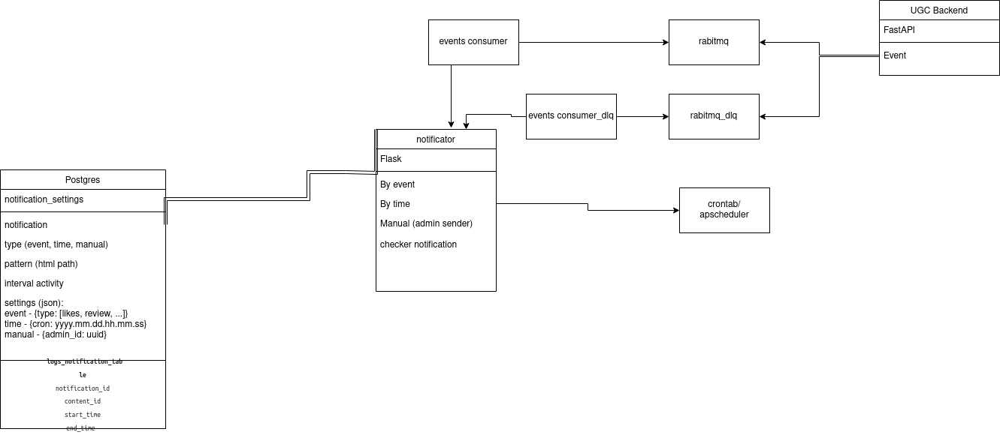

# Проектная работа 10 спринта

Link to the project: https://github.com/dondublon/ugc_sprint_1-1

Схема приложения приведена в doc/schema_notification.drawio.png .

## Описание логики. 
Главный сервис - notificator. 
Событие начинает свой путь на backend, публикуется в rabbiqmq, читается event_consumer-ом, 
и дёргаётся соответствующая ручка на notificator-е (on_event).
Кроме отправки по событию, есть возможность задать отправку по времени. Работает шедулер, вызывается каждый час. 
Шаблоны (не файлы, а несколько больше) сообщений лежат в базе notification_postgres, 
таблица notofication_pattern.
Есть три типа шаблонов - рассылки по событию, по времени и вручную. 
При наступлении события или времени происходит соответствующая выборка и цикл, по шаблонам
и по юзерам. Сложной логики, проверяющей, нужно ли конкретному юзеру разослать конкретное
сообщение, пока нет, но вставить можно легко. 
Конкретное событие посылки попадает в notofication_event. 

Имеется интеграционный тест. 

## Отказоуйстойчивость
Отказоуйстойчивость обеспечивается двумя очередями rabbitmq+event_consumer. 
Пытаемся отправить в rabbitmq, если не получается - то в rabbitmq_dlq. 
Даже если notificator выйдет из строя, сообщения останутся и будут обработаны. 
